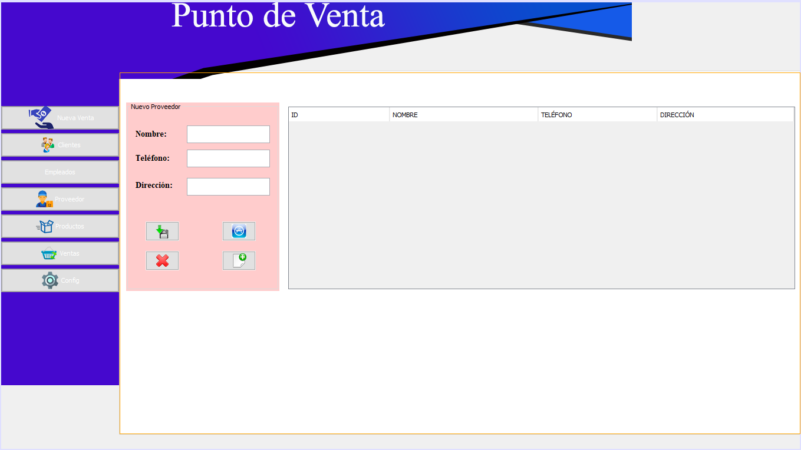

[ENGLISH](#english)
[ESPAÑOL](#español)

### ENGLISH
# Sales Point

[Description](#description)
[Main Functions](#main-functions)
[Screenshot](#screenshots)
[Instalation](#instalation)
[Use](#use)
[Contribution](#contribution)
[Contact](#contact)

## Description
This is a point of sale system developed in Java and MySQL that offers management functionalities for sales, employees, clients, products, suppliers, and company data. The system features a login interface that detects the user type (administrator or common employee) and directs the user to the respective panel.
## Main Functions:
Realiza ventas
Calcula descuentos
Gestiona, agrega, elimina usuarios
Gestión de clientes, productos y proveedores
Registro de historial de ventas
Genera de tickets de venta
Edita datos de la empresa
Make sales
Calculate discounts
Manage, add, delete users
Manage clients, products and suppliers
Generates sales tickets
Edit Company data

Process sales
Calculate discounts
Manage, add, delete users
Management of clients, products, and suppliers
Sales history records
Generate sales receipts/tickets
Edit company information

## Screenshots

## Instalation
1. Clone this repository.
2. Configurate the Database: Copy the SQL file from the folder "respaldos" "pos_2023-05-30" (this is the more updated file)
3. Execute Query: Paste in your MySQL query and execute.
4. Configure libraries: Install the jar/library in your java project (all the libraries are in the folder "libraries")
5. Configure conection: In the class "conexion" edit the user and the user password of your database server
6. Compilate and run: Run the project in your IDE
7. Ready! Now you can use the Calculator in your device. 
Configurar la Base de Datos: Importar el archivo SQL proporcionado en la carpeta database para crear la estructura de la base de datos y poblar las tablas iniciales.

Configurar la Conexión a la Base de Datos: En el archivo config.properties, configurar las credenciales de conexión a la base de datos.
## Use
- Open the Calculator app on your device.
- Tap the numbers and operators on the screen to perform your calculations.
- The result will be displayed at the top of the screen.

## Contribution
If you wish to contribute to this project, you are welcome! You can send suggestions, report problems, or submit pull requests. Make sure to follow the best development practices and respect the contribution guidelines.

## Contact
If you have any questions or comments about the Calculator, please feel free to contact me at [vguzmanloredo@gmail.com] or through my GitHub account.

### ESPAÑOL
# Calculadora

[Descripcion](#descripcion)
[Características Principales](#características-principales)
[Capturas de Pantalla](#Capturas-de-Pantalla)
[Instalacion](#instalación)
[Uso](#uso)
[Contribución](#contribución)
[Contacto](#contacto)

## Descripcion
This Android calculator app is a mobile application that allows you to perform a wide variety of mathematical calculations directly on your Android device. It was developed from scratch in Android Studio, 
without the use of external libraries, to provide a fast and efficient calculation experience.
## Características Principales
- Realiza operaciones matemáticas básicas, como suma, resta, multiplicación y división.
- Ejecuta cálculos avanzados, como operaciones con números decimales y potencias.
- Interfaz de usuario intuitiva y fácil de usar.
- Resultados precisos y rápidos.

## Capturas de Pantalla

## Instalación
1. Clona este repositorio.
2. Instala el archivo APK en tu dispositivo Android.
3. ¡Listo! Ahora puedes utilizar la Calculadora Android en tu dispositivo.

## Uso
- Abre la aplicación Calculadora Android en tu dispositivo.
- Toca los números y operadores en la pantalla para realizar tus cálculos.
- El resultado se mostrará en la parte superior de la pantalla.

## Contribución
Si deseas contribuir a este proyecto, ¡eres bienvenido! Puedes enviar sugerencias, informar problemas o enviar solicitudes de extracción. Asegúrate de seguir las mejores prácticas de desarrollo y respetar las pautas de contribución.

## Contacto
Si tienes alguna pregunta o comentario sobre la Calculadora Android, no dudes en ponerte en contacto conmigo en [vguzmanloredo@gmail.com] o en mi cuenta de GitHub.

¡Gracias por usar la Calculadora Android!
